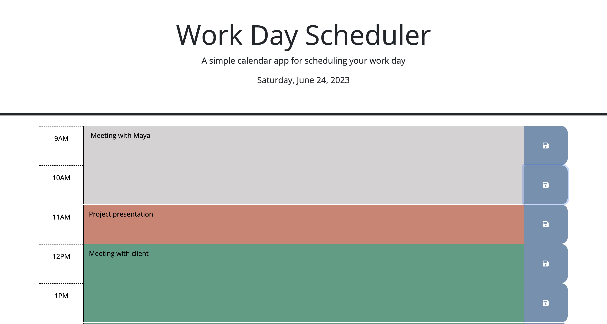
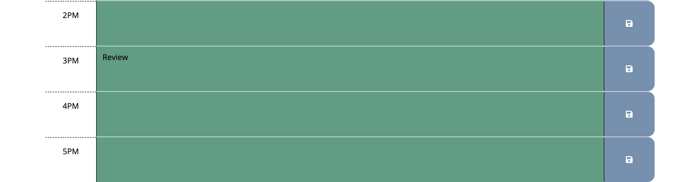
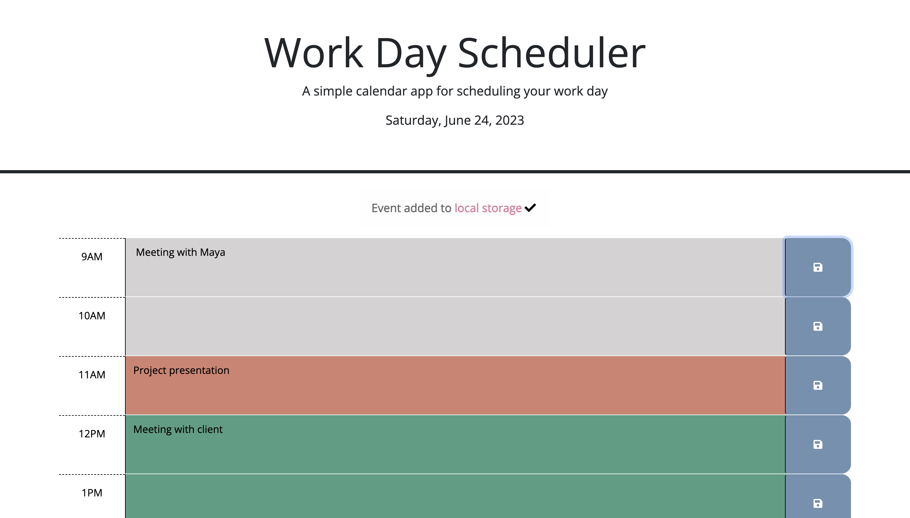
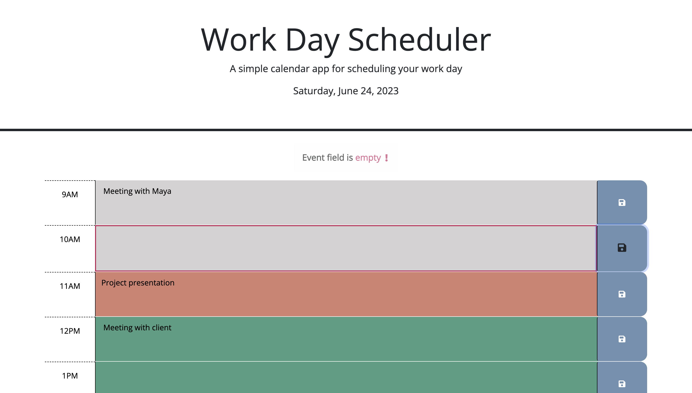

# Work Day Scheduler Webpage

## Description

This application builds a daily planner that allows the user to create a schedule to manage the time effectively. The user can add important events to the planner for each hour of a typical working day (9am–5pm). The planner displays the current day at the top and time blocks for standard business hours of 9am to 5pm. Each time block is color-coded to indicate whether it is in the past, present, or future. The past time blocks are given a grey background, the current time block is given a shade of red and the future time blocks are given a shade of green. The planner also displays the already saved events in the corresponding time blocks.

## Installation

N/A

## Usage

The user is presented with the current day on top of the calendar and time blocks for standard business hours of 9am to 5pm when the application is opened. The time blocks are color coded grey, red and green to indicate whether the time of the block is past , present or future respectively. The user can enter events clicking on the desired time block. When the user save an event by clicking on the save button then that event will be stored in to the local storage. Up on saving, a success message will be displayed for a short interval of time. If the entered text is blank, an alert message will be displayed unless it is a deletion of an already existing event. All saved events will be displayed in the planner in the corresponding time blocks.

The following images show the web application's appearance and functionality :

Link to website :

https://shimna-puthanayil.github.io/work-day-scheduler/

## Credits

References

https://stackoverflow.com/questions/3239598/how-can-i-get-the-id-of-an-element-using-jquery

https://developer.mozilla.org/en-US/docs/Web/JavaScript/Reference/Global_Objects/String/substring

## License

MIT license.
